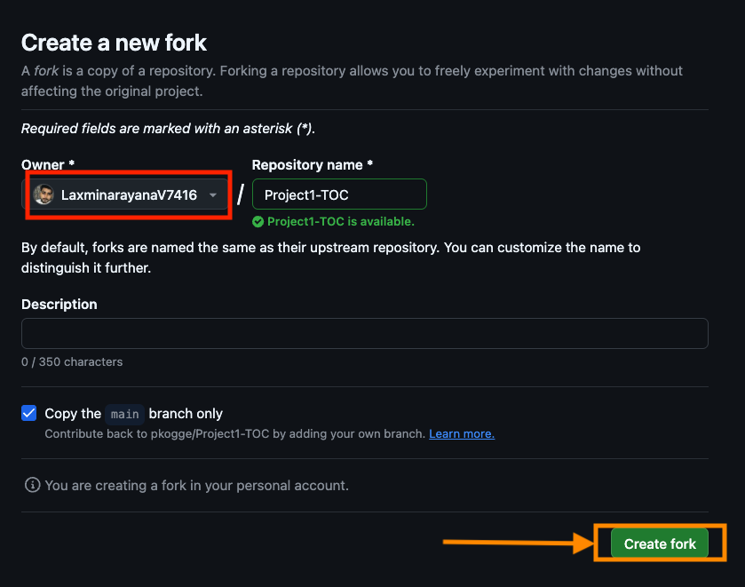

<!-- ## instructions to generate PAT: -->

* Instructions generated by Laxminarayana Vadnala lvadnala@nd.edu

<!-- * Go to GitHub → Settings → Developer settings → Personal access tokens → Tokens (classic)
* Click "Generate new token" → "Generate new token (classic)"
* Set expiration (90 days recommended)
* Select scopes: repo (full control of private repositories)
* Generate token and copy it -->


## Student Instructions to clone the repository and how to submit the assignment:
------------------
* From your browser, go to [GITHUB URL](https://github.com/pkogge/Project1-TOC) and click the fork button as shown in the picture below


* You will now enter the fork screen, from here make sure to select your own github account which is highlighted in screen below (for instance, I have selected my own personal account), after that click on the `create fork` button highlighted in orange arrow and box.



* You will now see the screen which looks like below, the first red box on left should reflect your own github account and should say forked from `forked from pkogge/Project1-TOC` then you can follow general instructions of cloning the github repository. Here is the [Docs Link](https://docs.github.com/en/repositories/creating-and-managing-repositories/cloning-a-repository) that help you to clone the github repository on your computer.


* Once you clone the repository open the project in the IDE of your choice.

### Getting started with the python support package manager "UV" installation
----------------

* Start  by installing `UV` in your machine. Here is the [instructions page](https://docs.astral.sh/uv/getting-started/installation/#__tabbed_1_1) that helps you to install the `UV`.

* Immediately after installing it run command `uv sync` which installs the pytests and other required packages.

* NOTE: If you are struggling with installing `UV` please feel to reach me out via slack, I can help you navigate so. lvadnala@nd.edu

* This project template is equipped with all the packages required for your project. No additional python packages are required to be installed, but if you want to install additional python packages make sure use the command `uv add <python-package-name>` (mostly it is not useful).

### How can we run the code using UV
----------------
* For this project I am using UV to demonstrate to run the code. Basically you need to use the command `uv run main.py` from the root of the project folder in the terminal to see your code executes.
* Immediately after cloning the repository, and you didnt do any code changes, if you run the command `uv run main.py` you would see the results below.

```
lax@Mac Project1-TOC % uv run main.py
Hello from project1_toc!
```

* the `Hello from project1_toc` message states that you are good to make changes to the code.

### Making changes to the code and running the test cases of your own
----------------

* Here is the folder structure that every student should make changes to. This is personalized for SAT, but the others are similar.

```
.
|── src/
│   |── entrypoint.py
|-- results/
|   |-- SATu.cnf
|-- module_tests/
|   |-- test_sample.py
|-- main.py
```

* `src/entrypoint.py` file contains the function called as `main.` Make sure to add all your files into the `src` folder and make sure to use the `entrypoint.py` file's main function as your main function Dont change this structure as if you do the automation wont be able to perform the grading.
* `results` folder is where you should save your results from the project. For SAT the project is expected to generate `cnf` files which are basically the CSV files, make sure to save all the results generated by code to results folder (!!! This is most important otherwise you might loose points).
* `module_tests` is the folder where you can add your own custom test cases. If you are familiar with pytests you can do so, but it is not compulsory to add test cases to the project, its totally the students choice to add, since the pytests have a little learning curve.
* `main.py` please dont edit this file, this is the main file and it should stay like this.
* Once you add your own test cases please make sure to run the `uv run pytest -s` (optional step, should only perform this if you haev added test cases as per the pytest standard)


### Commit the code and make sure to raise a PR (Pull Request)
---------------

* Push the changes to the repositiory. Here is the [Docs Link](https://docs.github.com/en/get-started/using-git/pushing-commits-to-a-remote-repository) that helps you with basic git commands to push the code.
* Now the last step is to raise the PR to the Forked repo, here is the [Docs link](https://docs.github.com/en/pull-requests/collaborating-with-pull-requests/proposing-changes-to-your-work-with-pull-requests/creating-a-pull-request-from-a-fork)
* Please update the PR link to the [Teams Spread Sheet](https://docs.google.com/spreadsheets/d/1FYyJMDnft__n0SohcIcSL7lUO60RMtJk9nuVJ5l30SY/edit?usp=sharing) shared by Dr. Kogge. This is most important since we grade only the links that are part of the teams spreadsheet.
